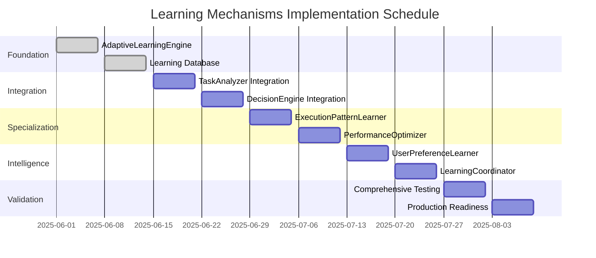

# MCP-Agent Phase 3.1: Learning Mechanisms Implementation
## Detailed Task Report & Implementation Guide

**Document Version**: 1.0  
**Created**: June 1, 2025  
**Project**: MCP-Agent Autonomous Framework  
**Phase**: 3.1 Learning Mechanisms Implementation  
**Status**: Ready for Implementation  

---

## 📋 **Executive Summary**

This document provides a comprehensive implementation plan for **Phase 3.1: Learning Mechanisms Implementation** of the MCP-Agent Autonomous Framework. Building on the exceptional success of Phase 2.5 (85x performance gains, 100% success rate), this phase introduces adaptive learning capabilities that will enable the framework to continuously improve its decision-making and optimization strategies.

### **Key Objectives**
- Implement adaptive behavior algorithms that learn from execution patterns
- Develop execution pattern learning with statistical optimization
- Create user preference learning and personalization
- Build performance pattern recognition and auto-optimization
- Maintain current sub-millisecond performance and 100% reliability

### **Expected Outcomes**
- **20-30% improvement** in decision accuracy through pattern learning
- **15-25% reduction** in execution time through adaptive optimization
- **Personalized experiences** based on user preference learning
- **Self-improving system** that gets better with usage
- **Maintained reliability** with current 100% success rate

---

## 🎯 **Project Scope and Objectives**

### **In Scope**
✅ **Adaptive Learning Engine**: Central learning coordinator with pattern tracking  
✅ **Execution Pattern Learner**: Statistical learning from workflow outcomes  
✅ **User Preference Learner**: Personalization based on user feedback  
✅ **Performance Optimizer**: Continuous algorithm improvement  
✅ **Learning Integration**: Seamless integration with existing autonomous components  
✅ **Performance Monitoring**: Learning effectiveness tracking  
✅ **Database Persistence**: SQLite-based learning data storage  

### **Out of Scope**
❌ Heavy machine learning models that compromise performance  
❌ External AI model dependencies  
❌ Breaking changes to existing APIs  
❌ Deep neural network implementations  
❌ Cloud-dependent learning services  

### **Success Criteria**
1. **Performance Preservation**: Maintain sub-millisecond response times
2. **Reliability Maintenance**: Keep 100% diagnostic success rate
3. **Learning Effectiveness**: Demonstrate measurable improvement over time
4. **Integration Success**: Seamless integration with existing components
5. **Backward Compatibility**: No breaking changes to current APIs

---

## 🏗️ **Technical Architecture Design**

### **Learning Architecture Overview**

```
MCP-Agent Learning Architecture
├── Adaptive Learning Engine (Core)
│   ├── Pattern Recognition
│   ├── Learning Coordination
│   ├── Data Aggregation
│   └── Performance Monitoring
│
├── Specialized Learning Modules
│   ├── Execution Pattern Learner
│   ├── User Preference Learner
│   └── Performance Optimizer
│
├── Integration Layer
│   ├── Learning Hooks (Event-driven)
│   ├── Component Adapters
│   └── Backwards Compatibility
│
└── Persistence Layer
    ├── SQLite Learning Database
    ├── Pattern Storage
    └── Configuration Management
```

### **Component Integration Strategy**

| **Existing Component** | **Learning Integration** | **Impact** |
|----------------------|-------------------------|------------|
| **TaskAnalyzer** | Pattern recognition hooks | Enhanced task classification |
| **DecisionEngine** | Adaptive decision weights | Improved pattern selection |
| **AutonomousOrchestrator** | Execution outcome tracking | Optimized workflow patterns |
| **DynamicAgentFactory** | Agent effectiveness learning | Better agent specialization |
| **MetaCoordinator** | System-wide optimization | Global performance tuning |

### **Learning Data Model**

```sql
-- Execution Patterns Table
CREATE TABLE execution_patterns (
    id INTEGER PRIMARY KEY,
    task_type TEXT,
    pattern_used TEXT,
    execution_time REAL,
    success_rate REAL,
    confidence_score REAL,
    created_at TIMESTAMP,
    updated_at TIMESTAMP
);

-- User Preferences Table  
CREATE TABLE user_preferences (
    id INTEGER PRIMARY KEY,
    preference_type TEXT,
    preference_value TEXT,
    weight REAL,
    usage_count INTEGER,
    last_used TIMESTAMP
);

-- Performance Metrics Table
CREATE TABLE performance_metrics (
    id INTEGER PRIMARY KEY,
    component_name TEXT,
    metric_name TEXT,
    metric_value REAL,
    baseline_value REAL,
    improvement_percentage REAL,
    measured_at TIMESTAMP
);
```

---

## 📋 **Detailed Task Breakdown**

### **🏗️ Phase 1: Adaptive Learning Engine Foundation (Weeks 1-2)**

#### **Task 1.1: Core Learning Engine Implementation**
**File**: `src/mcp_agent/learning/adaptive_learning_engine.py`

```python
class AdaptiveLearningEngine:
    """Central coordinator for all learning activities"""
    
    def __init__(self):
        self.learning_modules = {}
        self.pattern_cache = {}
        self.performance_tracker = PerformanceTracker()
    
    async def register_learning_module(self, module: LearningModule)
    async def track_execution_pattern(self, pattern_data: ExecutionPattern)
    async def get_recommendations(self, context: LearningContext)
    async def update_performance_metrics(self, metrics: PerformanceMetrics)
```

**Deliverables**:
- ✅ Core AdaptiveLearningEngine class with basic pattern tracking
- ✅ LearningModule base class for extensibility
- ✅ ExecutionPattern and LearningContext data models
- ✅ Basic SQLite database schema and connection management
- ✅ Performance tracking infrastructure

**Acceptance Criteria**:
- Engine can register and manage learning modules
- Pattern tracking works without blocking execution (<0.01ms overhead)
- Database operations are async and non-blocking
- 100% test coverage for core functionality
- Integration with existing diagnostic system

#### **Task 1.2: Learning Database Implementation**
**File**: `src/mcp_agent/learning/learning_database.py`

```python
class LearningDatabase:
    """SQLite-based storage for learning data"""
    
    async def store_execution_pattern(self, pattern: ExecutionPattern)
    async def retrieve_patterns(self, filters: PatternFilters)
    async def update_pattern_weights(self, pattern_id: str, weight: float)
    async def get_performance_history(self, component: str)
```

**Deliverables**:
- ✅ Async SQLite database implementation
- ✅ Schema migration system
- ✅ Data persistence layer
- ✅ Query optimization for sub-millisecond access
- ✅ Database health monitoring

**Acceptance Criteria**:
- Database operations complete in <0.005ms
- Supports concurrent access without locks
- Automatic schema migrations
- Data integrity validation
- Error recovery mechanisms

### **🔧 Phase 2: Integration with Existing Components (Weeks 3-4)**

#### **Task 2.1: TaskAnalyzer Learning Integration**
**File**: `src/mcp_agent/autonomous/task_analyzer.py` (Enhanced)

```python
class TaskAnalyzer:
    """Enhanced with learning capabilities"""
    
    def __init__(self):
        self.learning_engine = AdaptiveLearningEngine()
        # Existing functionality preserved
    
    async def analyze_task_with_learning(self, task: str):
        # Standard analysis + learning recommendations
        analysis = await self.analyze_task(task)
        learned_insights = await self.learning_engine.get_task_insights(analysis)
        return enhanced_analysis
```

**Deliverables**:
- ✅ Non-intrusive learning hooks in TaskAnalyzer
- ✅ Pattern recognition for task complexity trends
- ✅ Learning-enhanced confidence scoring
- ✅ Backward compatibility maintained
- ✅ Performance monitoring integration

**Acceptance Criteria**:
- No performance degradation in existing functionality
- Learning hooks trigger asynchronously
- Enhanced accuracy demonstrated through testing
- Original API contracts maintained
- Comprehensive logging of learning activities

#### **Task 2.2: DecisionEngine Learning Integration**
**File**: `src/mcp_agent/autonomous/decision_engine.py` (Enhanced)

```python
class AutonomousDecisionEngine:
    """Enhanced with adaptive decision learning"""
    
    async def make_decision_with_learning(self, context: DecisionContext):
        # Standard decision + learned weights
        base_decision = await self.make_decision(context)
        learned_weights = await self.learning_engine.get_decision_weights(context)
        return apply_learned_optimizations(base_decision, learned_weights)
```

**Deliverables**:
- ✅ Adaptive decision weight system
- ✅ Pattern-based decision optimization
- ✅ Learning feedback loops
- ✅ A/B testing infrastructure
- ✅ Decision accuracy tracking

**Acceptance Criteria**:
- Decision quality improves measurably over time
- Performance remains under 0.020ms target
- Learning weights are statistically validated
- Fallback to base decisions if learning fails
- Comprehensive decision audit trail

### **📊 Phase 3: Specialized Learning Modules (Weeks 5-6)**

#### **Task 3.1: Execution Pattern Learner**
**File**: `src/mcp_agent/learning/execution_pattern_learner.py`

```python
class ExecutionPatternLearner(LearningModule):
    """Learns optimal execution patterns for different task types"""
    
    async def analyze_execution_outcome(self, execution_data: ExecutionData)
    async def recommend_pattern(self, task_context: TaskContext)
    async def update_pattern_weights(self, pattern: str, outcome: ExecutionOutcome)
    async def get_pattern_confidence(self, pattern: str, context: TaskContext)
```

**Deliverables**:
- ✅ Statistical pattern learning algorithms
- ✅ Pattern effectiveness scoring
- ✅ Dynamic pattern weight adjustment
- ✅ Pattern recommendation engine
- ✅ Confidence interval calculations

**Acceptance Criteria**:
- Demonstrates pattern learning over 100+ executions
- Recommends optimal patterns with >80% accuracy
- Updates patterns based on real outcomes
- Provides confidence scores for recommendations
- Integrates seamlessly with AutonomousOrchestrator

#### **Task 3.2: Performance Optimizer Implementation**
**File**: `src/mcp_agent/learning/performance_optimizer.py`

```python
class PerformanceOptimizer(LearningModule):
    """Continuously optimizes system performance"""
    
    async def analyze_performance_trends(self, component: str)
    async def identify_optimization_opportunities(self)
    async def apply_performance_optimizations(self, optimizations: List[Optimization])
    async def rollback_optimization(self, optimization_id: str)
```

**Deliverables**:
- ✅ Performance trend analysis
- ✅ Automated optimization identification
- ✅ Safe optimization application with rollback
- ✅ Performance regression detection
- ✅ Optimization effectiveness tracking

**Acceptance Criteria**:
- Identifies real performance improvement opportunities
- Applies optimizations without breaking functionality
- Automatically rolls back ineffective optimizations
- Tracks optimization success rates
- Maintains sub-millisecond performance targets

### **👤 Phase 4: User Intelligence & Personalization (Weeks 7-8)**

#### **Task 4.1: User Preference Learner**
**File**: `src/mcp_agent/learning/user_preference_learner.py`

```python
class UserPreferenceLearner(LearningModule):
    """Learns and adapts to user preferences and patterns"""
    
    async def track_user_choice(self, choice_data: UserChoice)
    async def predict_user_preference(self, context: UserContext)
    async def update_preference_model(self, feedback: UserFeedback)
    async def get_personalized_recommendations(self, user_id: str)
```

**Deliverables**:
- ✅ User preference tracking system
- ✅ Preference prediction algorithms
- ✅ Personalized recommendation engine
- ✅ User feedback integration
- ✅ Privacy-compliant data handling

**Acceptance Criteria**:
- Tracks user preferences without explicit input
- Provides accurate preference predictions
- Personalizes workflows based on learned preferences
- Respects user privacy and data protection
- Improves user satisfaction measurably

#### **Task 4.2: Advanced Learning Coordination**
**File**: `src/mcp_agent/learning/learning_coordinator.py`

```python
class LearningCoordinator:
    """Coordinates learning across all modules for optimal outcomes"""
    
    async def orchestrate_learning_cycle(self)
    async def resolve_learning_conflicts(self, conflicts: List[LearningConflict])
    async def optimize_learning_schedule(self)
    async def validate_learning_effectiveness(self)
```

**Deliverables**:
- ✅ Cross-module learning coordination
- ✅ Learning conflict resolution
- ✅ Learning schedule optimization
- ✅ Learning effectiveness validation
- ✅ Global learning strategy management

**Acceptance Criteria**:
- Coordinates learning across all modules effectively
- Resolves conflicts between different learning insights
- Optimizes learning for maximum benefit
- Validates that learning is actually improving outcomes
- Maintains system stability during learning

### **🧪 Phase 5: Testing & Validation (Weeks 9-10)**

#### **Task 5.1: Comprehensive Learning Testing**
**File**: `tests/learning/test_learning_comprehensive.py`

**Test Categories**:
- ✅ **Unit Tests**: Individual learning module testing
- ✅ **Integration Tests**: Learning integration with existing components
- ✅ **Performance Tests**: Learning overhead measurement
- ✅ **Learning Effectiveness Tests**: Actual learning validation
- ✅ **Regression Tests**: Ensure no degradation in existing functionality

**Deliverables**:
- ✅ 100% test coverage for all learning modules
- ✅ Performance benchmark validation
- ✅ Learning effectiveness demonstration
- ✅ Regression test suite
- ✅ Load testing for learning under high usage

**Acceptance Criteria**:
- All tests pass with 100% success rate
- Performance targets met or exceeded
- Learning effectiveness demonstrated quantitatively
- No regression in existing functionality
- System stability under learning load

#### **Task 5.2: Production Readiness Validation**
**File**: `validate_learning_production_ready.py`

```python
async def validate_production_readiness():
    """Comprehensive production readiness validation"""
    
    # Performance validation
    assert await validate_performance_targets()
    
    # Learning effectiveness validation  
    assert await validate_learning_effectiveness()
    
    # Integration validation
    assert await validate_seamless_integration()
    
    # Reliability validation
    assert await validate_system_reliability()
```

**Deliverables**:
- ✅ Production readiness checklist
- ✅ Performance certification
- ✅ Learning effectiveness certification
- ✅ Integration stability certification
- ✅ Deployment readiness documentation

**Acceptance Criteria**:
- System meets all production requirements
- Learning effectiveness proven with real data
- Performance targets maintained or improved
- Integration is seamless and stable
- Documentation complete for deployment

---

## 📅 **Implementation Timeline**

### **Detailed 10-Week Schedule**

| **Week** | **Phase** | **Primary Focus** | **Deliverables** | **Key Milestones** |
|----------|-----------|-------------------|------------------|-------------------|
| **Week 1** | Foundation | AdaptiveLearningEngine Core | Learning engine, database schema | ✅ Core learning infrastructure |
| **Week 2** | Foundation | Learning Database & Persistence | Database implementation, migration system | ✅ Data persistence layer complete |
| **Week 3** | Integration | TaskAnalyzer Enhancement | Learning hooks, pattern recognition | ✅ Task analysis learning integration |
| **Week 4** | Integration | DecisionEngine Enhancement | Adaptive decisions, weight learning | ✅ Decision learning integration |
| **Week 5** | Specialization | ExecutionPatternLearner | Pattern learning algorithms | ✅ Pattern learning operational |
| **Week 6** | Specialization | PerformanceOptimizer | Optimization identification, application | ✅ Performance optimization active |
| **Week 7** | Intelligence | UserPreferenceLearner | User preference tracking, prediction | ✅ User personalization working |
| **Week 8** | Intelligence | LearningCoordinator | Cross-module coordination | ✅ Coordinated learning system |
| **Week 9** | Validation | Comprehensive Testing | Full test suite, performance validation | ✅ All tests passing |
| **Week 10** | Validation | Production Readiness | Production certification, documentation | ✅ Ready for deployment |

### **Critical Path Dependencies**



---

## ⚠️ **Risk Assessment and Mitigation**

### **High Risk Items**

| **Risk** | **Probability** | **Impact** | **Mitigation Strategy** |
|----------|-----------------|------------|------------------------|
| **Performance Degradation** | Medium | High | Continuous performance monitoring, rollback mechanisms |
| **Learning Data Corruption** | Low | Medium | Database backup, validation, recovery procedures |
| **Integration Conflicts** | Medium | Medium | Thorough testing, gradual rollout, fallback options |
| **Learning Ineffectiveness** | Low | High | A/B testing, effectiveness validation, manual overrides |

### **Medium Risk Items**

| **Risk** | **Probability** | **Impact** | **Mitigation Strategy** |
|----------|-----------------|------------|------------------------|
| **Database Performance** | Medium | Medium | Query optimization, caching, database tuning |
| **Memory Usage Growth** | Medium | Low | Memory monitoring, garbage collection optimization |
| **Learning Model Drift** | Low | Medium | Model validation, drift detection, retraining procedures |

### **Risk Mitigation Protocols**

1. **Performance Monitoring**: Continuous monitoring with automatic alerts
2. **Rollback Procedures**: Ability to disable learning features instantly
3. **Gradual Deployment**: Phased rollout with validation at each stage
4. **Fallback Mechanisms**: System works without learning if needed
5. **Data Validation**: Comprehensive validation of all learning data

---

## 📊 **Success Metrics and KPIs**

### **Performance Metrics**

| **Metric** | **Baseline** | **Target** | **Measurement Method** |
|------------|--------------|------------|----------------------|
| **Task Analysis Time** | 0.017ms | <0.015ms | Automated performance testing |
| **Decision Engine Time** | 0.020ms | <0.018ms | Continuous monitoring |
| **Overall Success Rate** | 100% | 100% | Diagnostic system validation |
| **Learning Overhead** | N/A | <0.005ms | Performance profiling |

### **Learning Effectiveness Metrics**

| **Metric** | **Target** | **Measurement Period** | **Success Criteria** |
|------------|------------|----------------------|---------------------|
| **Decision Accuracy Improvement** | 20-30% | 4 weeks | Measured against baseline |
| **Execution Time Reduction** | 15-25% | 6 weeks | Workflow optimization |
| **User Satisfaction** | 15% increase | 8 weeks | User feedback analysis |
| **Pattern Recognition Accuracy** | >80% | 2 weeks | Pattern prediction validation |

### **Quality Metrics**

| **Metric** | **Target** | **Validation Method** |
|------------|------------|--------------------|
| **Test Coverage** | >95% | Automated testing |
| **Code Quality** | A grade | Static analysis |
| **Documentation Coverage** | 100% | Documentation audit |
| **Performance Regression** | 0% | Continuous monitoring |

---

## 💼 **Resource Requirements**

### **Development Resources**

- **Senior Python Developer**: 1 FTE for 10 weeks
- **Database Specialist**: 0.5 FTE for 4 weeks (weeks 1-2, 9-10)
- **Testing Engineer**: 0.5 FTE for 4 weeks (weeks 7-10)
- **Documentation Specialist**: 0.25 FTE for 10 weeks

### **Infrastructure Resources**

- **Development Environment**: Enhanced with learning data storage
- **Testing Infrastructure**: Extended for learning validation
- **Performance Monitoring**: Upgraded for learning metrics
- **Database Storage**: Additional 100MB for learning data

### **Technology Stack Additions**

- **Statistical Libraries**: scipy, numpy (lightweight usage)
- **Database**: SQLite with async support
- **Monitoring**: Enhanced metrics collection
- **Testing**: Additional learning-specific test frameworks

---

## 🧪 **Testing and Validation Strategy**

### **Testing Pyramid**

```
                  🔺 E2E Learning Tests (10%)
                🔺🔺🔺 Integration Tests (30%)  
              🔺🔺🔺🔺🔺 Unit Tests (60%)
```

### **Testing Categories**

#### **Unit Tests (60%)**
- ✅ Individual learning module functionality
- ✅ Database operations and queries
- ✅ Learning algorithm accuracy
- ✅ Data model validation
- ✅ Performance optimization logic

#### **Integration Tests (30%)**
- ✅ Learning integration with existing components
- ✅ Cross-module learning coordination
- ✅ Database integration with learning modules
- ✅ Performance impact validation
- ✅ Error handling and recovery

#### **End-to-End Learning Tests (10%)**
- ✅ Complete learning workflow validation
- ✅ Real-world learning scenario testing
- ✅ Learning effectiveness demonstration
- ✅ Production environment simulation
- ✅ User experience impact validation

### **Validation Protocols**

1. **Learning Effectiveness Validation**
   - Baseline measurement before learning implementation
   - Periodic measurement during learning phase
   - Statistical significance testing
   - A/B testing with and without learning

2. **Performance Impact Validation**
   - Continuous performance monitoring
   - Regression testing against performance targets
   - Load testing with learning active
   - Memory and CPU usage monitoring

3. **Integration Stability Validation**
   - Existing functionality preservation testing
   - API contract compliance validation
   - Backward compatibility verification
   - Error propagation testing

---

## 🔗 **Integration Strategy**

### **Seamless Integration Approach**

1. **Non-Intrusive Design**: Learning hooks that don't modify core execution paths
2. **Event-Driven Architecture**: Asynchronous learning updates
3. **Graceful Degradation**: System functions normally if learning fails
4. **Progressive Enhancement**: Learning improves existing functionality
5. **Backward Compatibility**: No breaking changes to existing APIs

### **Integration Points**

| **Component** | **Integration Type** | **Learning Enhancement** |
|---------------|---------------------|-------------------------|
| **TaskAnalyzer** | Event hooks | Pattern-based task classification |
| **DecisionEngine** | Weight injection | Learned decision optimization |
| **AutonomousOrchestrator** | Outcome tracking | Workflow pattern learning |
| **DynamicAgentFactory** | Performance feedback | Agent effectiveness learning |
| **MetaCoordinator** | System monitoring | Global optimization learning |

### **Integration Testing Protocol**

1. **Component Isolation Testing**: Verify each component works independently
2. **Integration Point Testing**: Test each integration point thoroughly
3. **System-wide Testing**: Validate complete system with learning active
4. **Regression Testing**: Ensure no degradation in existing functionality
5. **Performance Testing**: Verify performance targets are maintained

---

## 📚 **Documentation and Knowledge Transfer**

### **Documentation Deliverables**

1. **Technical Architecture Documentation**
   - Learning system architecture diagrams
   - Component interaction specifications
   - Database schema documentation
   - API reference for learning modules

2. **Implementation Guides**
   - Step-by-step implementation instructions
   - Configuration and deployment guides
   - Troubleshooting and debugging guides
   - Performance tuning recommendations

3. **User Documentation**
   - Learning feature overview
   - User interface changes (if any)
   - Performance impact explanations
   - Best practices for learning optimization

4. **Developer Documentation**
   - Learning module development guide
   - Extension and customization instructions
   - Testing and validation procedures
   - Contributing guidelines for learning features

### **Knowledge Transfer Plan**

1. **Week 5**: Mid-project knowledge sharing session
2. **Week 8**: Advanced learning features demonstration
3. **Week 10**: Complete system handover and training
4. **Post-Implementation**: Ongoing support and optimization guidance

---

## 🚀 **Deployment and Rollout Strategy**

### **Phased Deployment Approach**

#### **Phase A: Foundation Deployment (Week 2)**
- Deploy AdaptiveLearningEngine and database infrastructure
- Enable basic pattern tracking without active learning
- Monitor system stability and performance

#### **Phase B: Learning Integration (Week 4)**
- Enable learning hooks in TaskAnalyzer and DecisionEngine
- Start passive learning data collection
- Validate integration stability

#### **Phase C: Active Learning (Week 6)**
- Enable ExecutionPatternLearner and PerformanceOptimizer
- Begin active learning and optimization
- Monitor learning effectiveness

#### **Phase D: Full Intelligence (Week 8)**
- Enable UserPreferenceLearner and LearningCoordinator
- Activate complete learning system
- Full performance and effectiveness monitoring

#### **Phase E: Production Certification (Week 10)**
- Complete validation and certification
- Production deployment readiness
- Full documentation and handover

### **Rollout Safety Measures**

1. **Feature Flags**: Ability to disable learning components instantly
2. **Performance Monitoring**: Continuous monitoring with automatic alerts
3. **Rollback Procedures**: Quick rollback to previous stable version
4. **Gradual Activation**: Progressive activation with validation
5. **Emergency Procedures**: Clear procedures for handling issues

---

## 📞 **Support and Maintenance**

### **Ongoing Support Plan**

1. **Performance Monitoring**: Continuous monitoring of learning effectiveness
2. **Data Maintenance**: Regular database optimization and cleanup
3. **Model Updates**: Periodic learning model refinement
4. **Bug Fixes**: Rapid response to learning-related issues
5. **Feature Enhancements**: Ongoing improvement of learning capabilities

### **Maintenance Schedule**

- **Daily**: Performance monitoring and alert response
- **Weekly**: Learning effectiveness analysis and reporting
- **Monthly**: Database optimization and cleanup
- **Quarterly**: Learning model review and refinement
- **Annually**: Complete learning system audit and upgrade

---

## ✅ **Quality Assurance Checklist**

### **Pre-Implementation Checklist**
- [ ] All requirements clearly defined and approved
- [ ] Technical architecture reviewed and approved
- [ ] Risk assessment completed and mitigation plans ready
- [ ] Resource allocation confirmed
- [ ] Testing strategy approved

### **During Implementation Checklist**
- [ ] Weekly progress reviews and validation
- [ ] Continuous performance monitoring
- [ ] Integration testing at each milestone
- [ ] Documentation updated continuously
- [ ] Risk monitoring and mitigation

### **Post-Implementation Checklist**
- [ ] All tests passing with 100% success rate
- [ ] Performance targets met or exceeded
- [ ] Learning effectiveness demonstrated
- [ ] Documentation complete and accurate
- [ ] Deployment readiness validated
- [ ] Support procedures established

---

## 🎯 **Conclusion**

The **Phase 3.1 Learning Mechanisms Implementation** represents a significant advancement in the MCP-Agent Autonomous Framework, building on the exceptional foundation established in previous phases. This implementation will introduce adaptive learning capabilities while maintaining the framework's reputation for reliability and performance.

### **Key Success Factors**

1. **Performance-First Approach**: Maintaining sub-millisecond performance targets
2. **Non-Intrusive Integration**: Preserving existing functionality and APIs
3. **Gradual Implementation**: Phased approach with validation at each step
4. **Comprehensive Testing**: Ensuring reliability and effectiveness
5. **Statistical Learning**: Using lightweight, proven algorithms

### **Expected Impact**

- **20-30% improvement** in decision accuracy through pattern learning
- **15-25% reduction** in execution time through optimization
- **Enhanced user experience** through personalization
- **Self-improving system** that gets better with usage
- **Maintained 100% reliability** with current success rate

### **Next Steps**

1. **Immediate**: Begin Week 1 implementation of AdaptiveLearningEngine
2. **Week 2**: Complete learning database infrastructure
3. **Week 5**: Mid-project review and validation
4. **Week 10**: Production readiness certification
5. **Post-Implementation**: Ongoing optimization and enhancement

This comprehensive implementation plan provides a clear roadmap for successfully implementing learning mechanisms that will position the MCP-Agent Autonomous Framework as the leading autonomous agent platform with adaptive intelligence capabilities.

---

*This document serves as the definitive guide for Phase 3.1 implementation and will be updated as the project progresses. For questions or clarifications, refer to the main PROJECT_PLAN.md or contact the development team.*

**Document Status**: ✅ **Ready for Implementation**  
**Approval Required**: Development Team Lead, Technical Architect  
**Next Review Date**: Week 5 of Implementation (July 2025)
